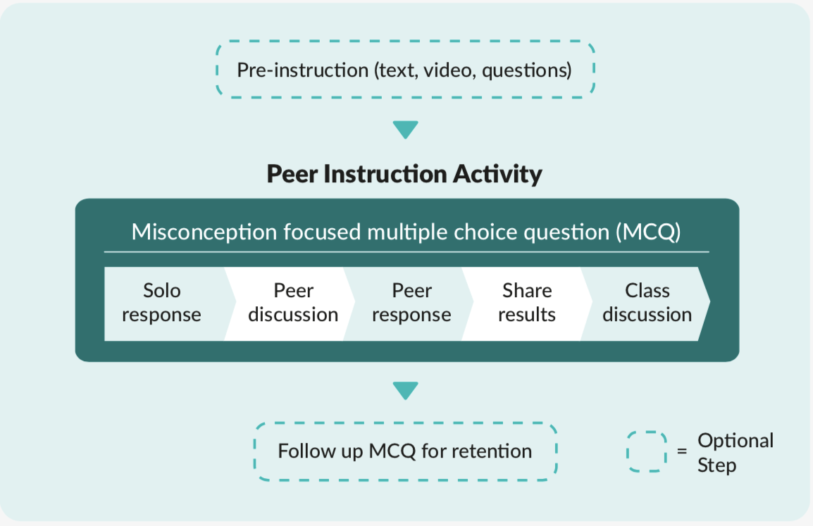

# How do you use Peer Instruction in your teaching?

Peer Instruction can replace a traditional presentation approach by combining pre-instruction, multiple choice questions, and peer discussion, to encourage deeper engagement with the content in question. While the use of multiple choice questions (MCQs) is commonplace in classroom teaching, they are often only used for assessment. Peer instruction relies on carefully selected MCQs based on some pre-instruction material. In class, the MCQs are combined with peer discussion to explore and challenge student understanding. 

## Stages of Peer Instruction

Peer Instruction follows a number of stages, beginning with **pre-instruction**. Pre-instruction is a method in which teachers introduce pupils to a concept in advance of the next lesson. Pre-instruction materials were traditionally extracted from text-books or articles. Educators sought to ensure that students read these materials before lectures. For schools, pre-instruction can be text-based, or can use videos or visuals such as a diagram or mind-maps relating to the concept to be taught. Where home learning is not possible, pre-instruction activities should build on previous lessons, or even on content studied earlier in the lesson.

During the lesson, **Multiple Choice Questions** and **peer discussion** are then used to deepen understanding of the key concepts being taught. Using carefully-chosen options for the incorrect 'distractor' answers in the Multiple Choice Questions (MCQs) allows the teacher to identify specific misconceptions that the pupils hold and to address these misconceptions during the lesson. 

After answering independently, pupils engage in peer discussion about the possible answers, aiming to reach a consensus and answer as a group. 

The teacher then leads a class discussion to address any misconceptions held by the pupils and to link to the pre-instruction materials and content of the lesson. Teachers may choose to use a different but related MCQ to check for understanding later in the lesson, or later in the unit of work, to check for understanding.

To better understand how to use the **MCQ cycle** in your lessons, watch the short video below.

![PIanimation]

Peer Instruction is not an assessment tool, but a means of instruction; teachers should shift the focus away from getting the correct answers, and instead, promote the participation and discussion aspects of the approach. The peer discussion in Step 3 is particularly important and should run between 2–4 minutes. This can feel like a long time, but it is time well spent! 

More information about using MCQs in this project, along with the resources for the lessons, will be provided throughout this course.

Click the green button (below right) to go to the next step in this session.

You can go back to the [list of contents for this session (Session 1) here](https://projects.raspberrypi.org/en/projects/gbic-peer-instruction-1).
You can access the [menu for Sessions 1 and 2 here](https://projects.raspberrypi.org/en/pathways/gbic-peer-instruction-training).
